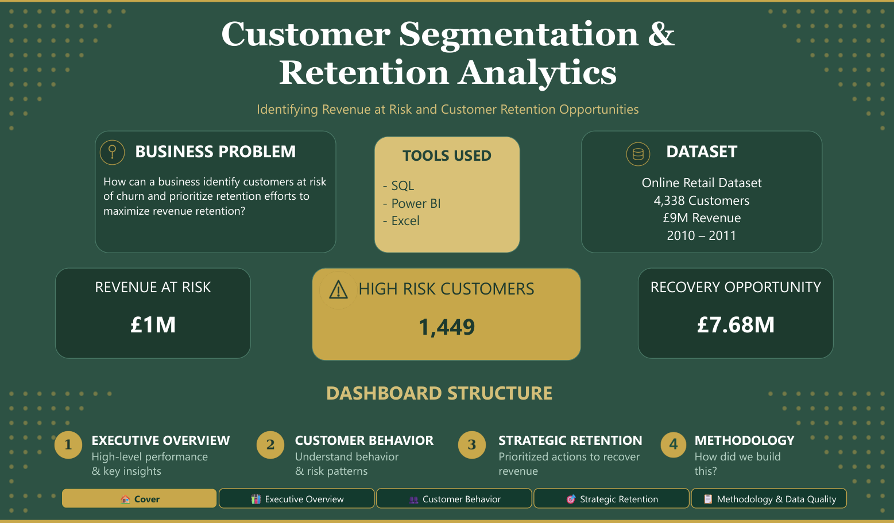
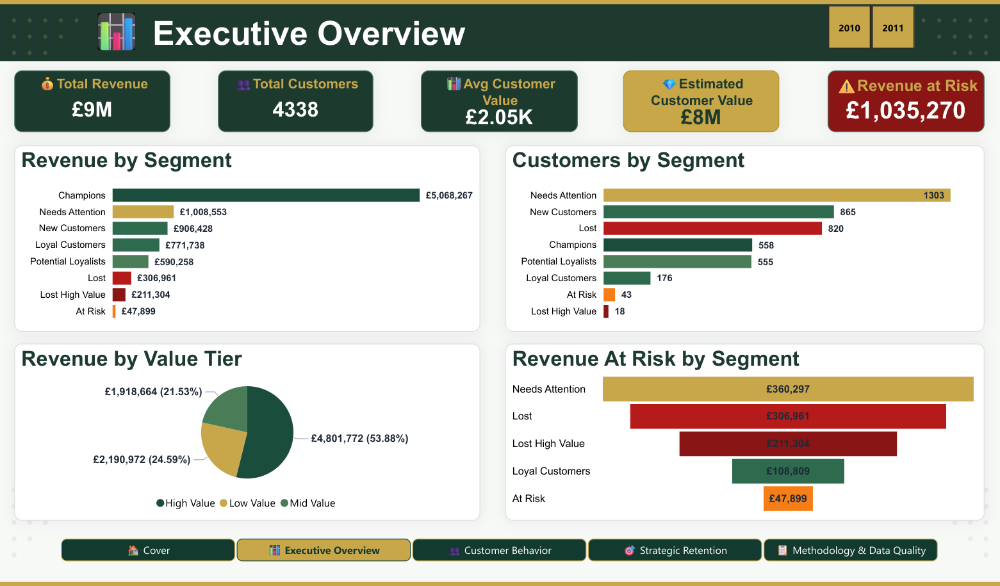
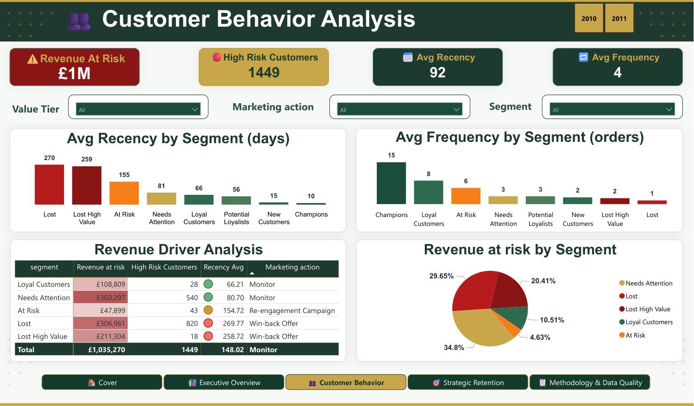
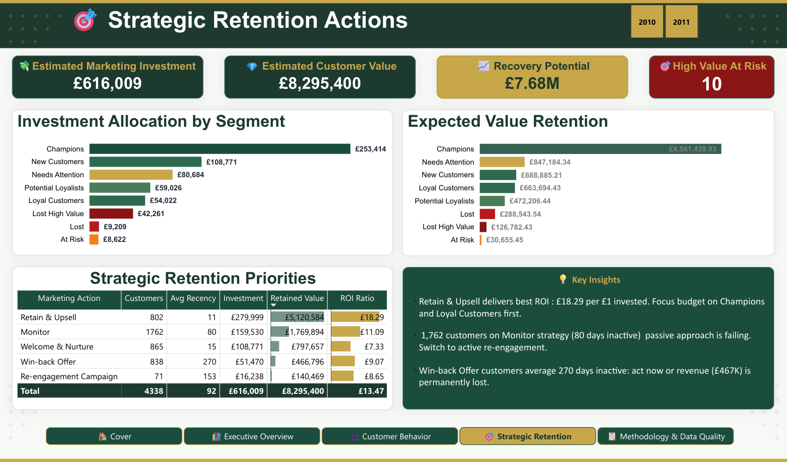
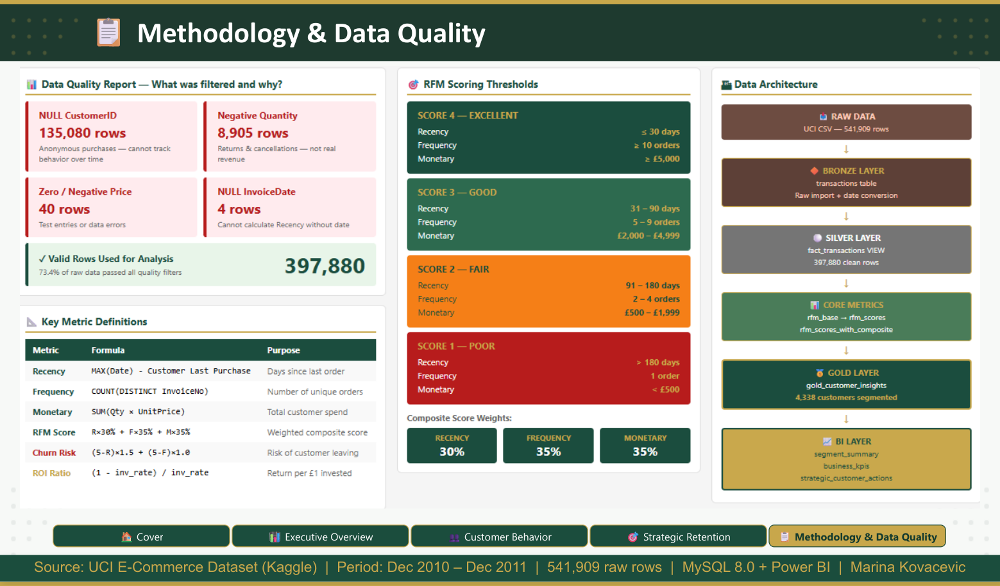

<h1> Customer Segmentation & Retention Analytics</h1>

**Identifying Revenue at Risk and Customer Retention Opportunities**

An end-to-end customer analytics project using **MySQL 8.0 and Power BI** to segment 4,338 customers by Recency, Frequency, and Monetary behavior, identify revenue at risk, and prioritize retention actions through a simulated marketing investment strategy.

---

## 📊 Dashboard

### Cover



### Executive Overview



### Customer Behavior



### Strategic Retention Actions



### Methodology & Data Quality



---

## 🎯 Business Problem

**How can a business identify customers at risk of churn and prioritize retention efforts to protect revenue?**

This project transforms raw transactional data into:

- RFM customer segmentation
- customer risk classification
- revenue-at-risk analysis
- customer value tiers
- prioritized retention actions
- simulated marketing investment and ROI

---

## 📈 Key Results

| KPI | Result |
|---|---:|
| Customers analyzed | **4,338** |
| Valid transactions | **397,880** |
| Total revenue | **£8.91M** |
| Champions | **558 (13%)** |
| Champions revenue share | **56.87%** |
| High-risk customers | **1,449** |
| Revenue at Risk | **£1.04M (11.62%)** |
| Portfolio churn risk | **6.22 — Warning** |
| Retained Value (Gross) | **£8.30M** |
| Recovery Potential (Net) | **£7.68M** |

### 💡 Key Business Insights

- **Champions** represent only 13% of customers but generate **56.87% of total revenue**.
- **1,449 customers** are classified as High Risk, representing approximately **£1.04M (11.62%) of historical revenue**.
- **Needs Attention** is the largest segment with **1,303 customers**.
- **Lost High Value** contains only **18 customers** but represents approximately **£211K** in historical revenue.
- **Retain & Upsell** has the highest simulated ROI ratio at **£18.29 of retained value per £1 invested**.
- The overall portfolio is in a **Warning** health zone with an average churn risk of **6.22**.
- The simulated retention strategy produces **£7.68M net Recovery Potential** after **£616K** of simulated marketing investment.

---

## 🗂️ Dataset

**Source:** [UCI Online Retail Dataset via Kaggle](https://www.kaggle.com/datasets/carrie1/ecommerce-data)

**Period:** December 2010 – December 2011

| Metric | Value |
|---|---:|
| Raw transactions | 541,909 |
| Valid transactions | 397,880 |
| Customers | 4,338 |
| Countries | 38 |
| Total revenue | £8,911,407.90 |

---

## 🧮 Methodology

The project uses **RFM analysis** at customer level:

| Metric | Definition | Business Meaning |
|---|---|---|
| **Recency** | Days since last purchase | How recently the customer bought |
| **Frequency** | Distinct invoice count | How often the customer buys |
| **Monetary** | Total transaction value | How much the customer spends |

### RFM Scoring

Fixed 1–4 thresholds are used for stable, interpretable business rules:

| Score | Recency | Frequency | Monetary |
|---|---|---|---|
| **4 — Excellent** | ≤ 30 days | ≥ 10 orders | ≥ £5,000 |
| **3 — Good** | 31–90 days | 5–9 orders | £2,000–4,999 |
| **2 — Fair** | 91–180 days | 2–4 orders | £500–1,999 |
| **1 — Poor** | > 180 days | 1 order | < £500 |

### Composite RFM Score

```text
RFM Composite = R × 30% + F × 35% + M × 35%
```

### Churn Risk

```text
Churn Risk = (5 - R_score) × 1.5 + (5 - F_score) × 1.0
```

The theoretical score range is **2.5–10.0**, with higher values indicating greater risk.

### Customer Segments

Customers are classified into eight actionable segments:

**Champions · Loyal Customers · New Customers · Potential Loyalists · Needs Attention · At Risk · Lost High Value · Lost**

---

## 📐 Business Metrics

### Revenue at Risk

```text
Revenue at Risk =
SUM(Monetary) WHERE risk_group = 'High Risk'
```

`High Risk` is defined by the recency score:

```text
r_score ≤ 2
```

This deliberately identifies customers showing recency-based warning signs regardless of their broader segment label.

**Revenue at Risk: £1,035,270.41 (11.62%)**

The same definition is used in both the SQL `business_kpis` view and the Power BI dashboard.

### Retention Investment Simulation

The strategic layer assigns a segment-specific investment rate and calculates:

```text
Estimated Marketing Investment
= Monetary × Investment Rate

Estimated Customer Value
= Monetary × (1 − Investment Rate)

ROI Ratio
= (1 − Investment Rate) / Investment Rate
```

The ROI ratio represents simulated retained customer value per £1 of investment.

> **Important:** ROI figures are scenario-based simulations, not observed historical marketing ROI.

### Retained Value vs. Recovery Potential

```text
Retained Value (Gross)
= SUM(Estimated Customer Value)

Recovery Potential (Net)
= Retained Value − Total Marketing Investment
```

Current portfolio-level values:

```text
Retained Value     £8,295,400
Marketing Invest. £616,009
Recovery Potential £7,679,391
```

---


## 🏗️ Data Architecture

```text
📥 RAW DATA
   UCI Online Retail CSV — 541,909 rows
        │
        ▼
🔶 BRONZE
   transactions
   Raw import + date cleaning
        │
        ▼
⚪ SILVER
   fact_transactions
   Valid analyzable transactions — 397,880 rows
        │
        ▼
📊 CORE RFM
   rfm_base
        ↓
   rfm_scores
        ↓
   rfm_scores_with_composite
        │
        ▼
🥇 GOLD
   gold_customer_insights
   Customer segments + value tiers + risk + actions
        │
        ▼
📈 BI / REPORTING
   segment_summary
   business_kpis
        │
        ▼
🎯 STRATEGIC
   strategic_customer_actions
        │
        ▼
📊 POWER BI
   Executive Overview
   Customer Behavior
   Strategic Retention Actions
```

---

## 🛠️ Tech Stack

### MySQL 8.0

- Data ingestion and cleaning
- RFM calculations
- Fixed-threshold scoring
- Customer segmentation
- Risk classification
- Executive KPIs
- Marketing investment simulation

### Power BI Desktop

- Data modeling
- DAX measures
- KPI cards
- Interactive visuals
- Conditional formatting
- Strategic retention analysis

### Excel

Used for supplementary validation and cross-checking.

---

## 🚀 Quick Start

### Prerequisites

- MySQL 8.0+
- MySQL Workbench or another MySQL client
- Power BI Desktop
- MySQL Connector/NET

### 1. Clone the repository

```bash
git clone https://github.com/<your-username>/rfm-customer-segmentation.git
cd rfm-customer-segmentation
```

### 2. Set up the database

The repository includes a database dump for the fastest setup:

```bash
mysql -u root -p < data/rfm_analysis_dump.sql
```

Alternatively, run:

```text
RFM_Analysis_Final.sql
```

from MySQL Workbench using the original dataset.

### 3. Open Power BI

Open:

```text
rfm_analysis.pbix
```

If prompted, update the MySQL credentials:

**Home → Transform data → Data source settings**

Then run:

**Home → Refresh**

---

## 📁 Repository Structure

```text
rfm-customer-segmentation/
│
├── README.md
│
├── sql/
│   └── RFM_Analysis_Final.sql
│
├── data/
│   └── rfm_analysis_dump.sql
│
├── powerbi/
│   └── rfm_analysis.pbix
│
├── images/
│   ├── Cover.png
│   ├── Executive_Overview.png
│   ├── Customer_Behavior.png
│   ├── Strategic_Retention.png
│   ├── Methodology.png
└── docs/
    └── RFM_SQL_Documentation.pdf
```

---

## 📄 Detailed Documentation

For the complete SQL methodology, validation queries, business-rule explanations, calculations, and worked examples, see:

[RFM_SQL_Documentation](docs/RFM_SQL_Documentation.pdf)

---

## 👤 Author

### Marina Kovačević
### Data Analyst
## LinkedIn:  https://www.linkedin.com/in/marina-kovacevic-data  
## GitHub: https://github.com/kovacevicmarina

---

## 📜 License

This project uses the [UCI Online Retail Dataset](https://www.kaggle.com/datasets/carrie1/ecommerce-data), made available through Kaggle for educational and research purposes.

